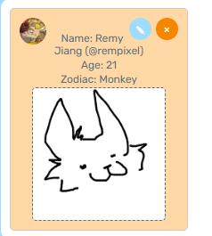

## Drawing Application!

Your Render (or alternative server) link e.g. https://a3-yihongjiang-a25.xvr6.dev/

Include a very brief summary of your project here. Images are encouraged, along with concise, high-level text. Be sure to include:
### Goals
The goal of my application is intended to be a fun, fridge magnet-like drawing posting website where users draw and post right onto the website. Users are allowed one post. They can edit, and delete their post if they would like. By drawing again and resubmitting they can correct any drawing mistakes. Users are asked for their birthday to calculate their age and derive their Chinese Zodiac as well. There no real reason for it, I just thought it was fun.

The screenshot includes what a post would look like after a user submits their drawing and the required fields!
### Challenges
While creating the application I ran into some issues with MongoDB and Mongoose. I also had a weird issue where routes were not being fetched. I moved the initialization calls to after the routes were defined and that seems to have fixed that issue.

MongoDB is mostly due to my lack of experience with a NOSQL DB solution and I found it to not be extremely necessary because my data can vary easily be stored in a PostgreSQL database. Even if any dynamic data would need to be stored, PostgreSQL can store JSON datatypes.

I also had an issue with Mongoose with MongoDB. Apparently the latest version of Mongoose cannot recognize any available clusters to connect to.

### Authentication Strategy
I chose GitHub authentication by using OAuth and PassportJS mostly because I had some experience doing something similar with WPI login in my Software Engineering course where we used Entra (Before ITS realized it was a security vulnerability for all students to have access to this and removed it.) instead of Github.

### CSS Framework Used
I used TailwindCSS because I have been meaning to experiment and learn it and this project presented the perfect opportunity to do so. I found it to be extremely similar to inline css styles and familiar due to that but also because it offers a lot of robustness and removes magic numbers from css inline styles. Regardless, I still used some inline-styles because I did them before introducing Tailwind. Tailwind also makes some complicated CSS things a lot simpler. I made some modifications to the framework, it's mostly through the existing styles from A2 because Tailwind allowed me to port them over.

#### Express Middlewares
1. Express JSON - Built in middleware to help interpret JSON data sent from the client.
2. Express UrlEncoded - Built in middleware to help parse URL-encoded form data to make it accessible as a JSON basically.
3. Express Session - An additional express middleware to help manage user sessions with Express!
4. Passport - PassportJS Middleware to help with my Github login functionality. I used it to create new users to submit to my DB as well. It was also used to auto fill the user's name using their github name.
5. Express Static - Built in middleware to serve a static page.

## Technical Achievements
- **Tech Achievement 1**: I used OAuth authentication via the GitHub strategy.
- **Tech Achievement 2**: I am hosting it remotely on my roommate's NAS! It's technically free outside of my power bill but it's been running even if I was not hosting this. I like this because I can control it a lot better and not have to worry about having to contact support when something goes wrong since I can debug it myself with a bit more control.

### Design/Evaluation Achievements
- **Design Achievement 1**: I followed the following tips from the W3C Web Accessibility Initiative...
- I made sure to label all my buttons to ensure clarity and did not rely on just color to convey information.
- I made sure interactive elements are clear. Hovering over any interactable element would change the color and the canvas is labeled as an input element. The cursor also changes when hovering over the canvas.
- Form elements have clearly associated labels.
- Errors on unfilled form entries result in alerts from the website. This would interrupt the user's flow to go back to fix the errors.
- Every form control has a label associated with them.
- I wrote simple alt text for users' github profile pictures when they are used.
- My html page is tagged with the primary language of the page (english).
- Error messages and instructions are written with clear and simple language.
- My link texts describe what they do. Logout when users are logged in, Log in with Github when users are not logged in (they are not buttons but just big links)
- I made sure to keep the foreground elements and the background elements have enough contrast to make them readable.
- I made sure to keep all elements to work on different viewports. I tested them through chrome developer tools. The only thing that does not change is my canvas. It is a design decision because it would make drawing on the canvas inefficient if I were to shrink with the viewport.
- My website reflects the reading order in code. I tested this by removing my stylesheet and it presents in a logical manner.
